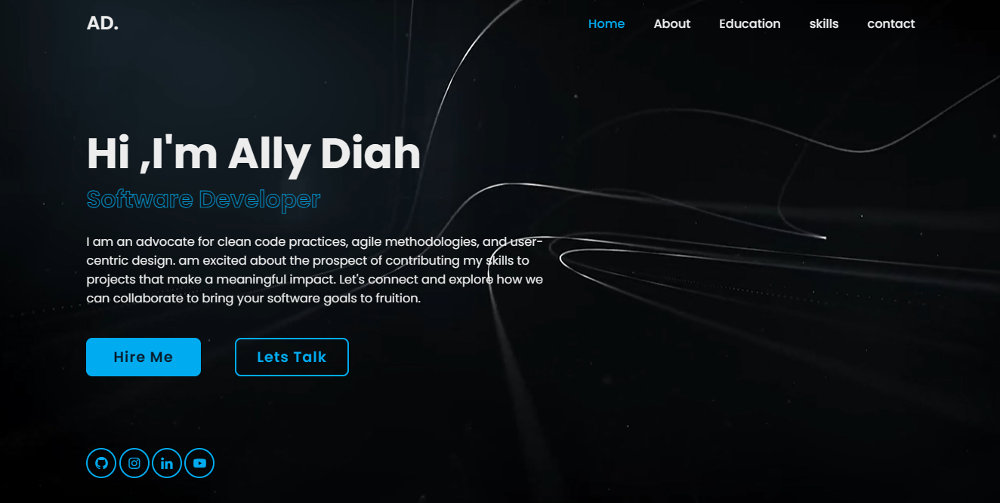

# Portfolio Project

Welcome to my portfolio project! This project is designed to showcase my skills in front-end web development using HTML, CSS, and JavaScript as part of my career and learning journey as we never stop learning. Here, you'll find a glimpse of my creativity, attention to detail, and dedication to creating visually appealing and interactive web experiences.

## Table of Contents

- [Introduction](#introduction)
- [Features](#features)
- [Technologies Used](#technologies-used)
- [Getting Started](#getting-started)
- [Usage](#usage)
- [Screenshots](#screenshots)
- [Contributing](#contributing)
- [License](#license)

## Introduction

This portfolio project serves as a showcase of my abilities in front-end development. It is a dynamic and responsive website that highlights my projects, skills, and a bit about myself. Through this project, I aim to demonstrate my proficiency in crafting user-friendly interfaces and creating a seamless user experience.

## Features

- **Responsive Design:** Ensures a consistent and optimal user experience across various devices and screen sizes.
- **Project Showcase:** Displays a curated selection of my notable projects, providing insights into my coding style and problem-solving skills.
- **Skills Section:** Highlights the technologies and tools I am proficient in, giving visitors a quick overview of my expertise.
- **About Me:** Offers a brief introduction about myself, my passion for web development, and what drives me to create exceptional digital experiences.

## Technologies Used

- **HTML:** For structuring the content and building the foundation of the web pages.
- **CSS:** Styles the HTML elements, ensuring a visually appealing and cohesive design.
- **JavaScript:** Adds interactivity and enhances user experience through dynamic features.

## Getting Started

To view this portfolio project locally, follow these steps:

1. Clone this repository to your local machine.
   ```bash
   git clone https://github.com/your-username/portfolio-project.git
   ```

2. Open the project folder in your preferred code editor.

3. Open the `index.html` file in your web browser.

## Usage

Feel free to explore the various sections of the portfolio:

- Click on project thumbnails to learn more about each project.
- Navigate through the different sections using the menu.

## Screenshots


                                                     

*Add more screenshots as needed*

## Contributing

If you have suggestions for improvements, please open an issue or create a pull request. Contributions are highly welcomed!

## License

This project is licensed under the [MIT License](LICENSE). Feel free to use, modify, and distribute the code for your projects.
